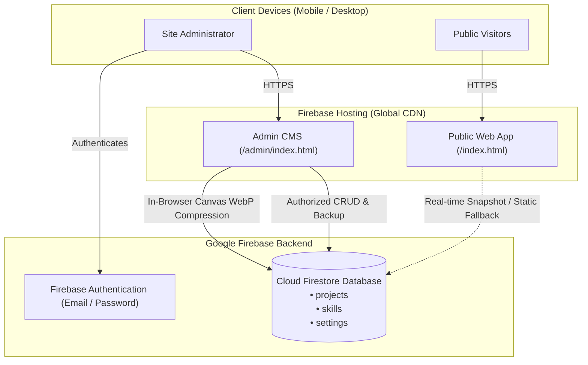

# 🚀 Vinsensius Arka — Personal Portfolio & Headless CMS

[](https://vinsensiusarka.id)
[](https://vinsensiusarka.id/admin/)
[](https://firebase.google.com/)
[](https://github.com/vinsensiusarko/vinsensiusarko-portfolio/actions)
[](LICENSE)

A modern, high-performance developer portfolio and serverless headless Content Management System (CMS) designed for software engineers. Built with clean, vanilla web technologies and powered by Google Cloud Firestore and Firebase Authentication with zero external build-step overhead.

---

## 🌟 Key Highlights

- **⚡ Blazing Fast Performance:** Vanilla ES6+ and modern CSS with zero heavy frontend frameworks. Achieves lightning-fast Core Web Vitals, preconnected Google Fonts, non-blocking CSS rendering, and optimized HTTP caching.
- **🔍 Project Explorer & Live Filtering:** Client-side real-time search bar and category filter chips (`All`, `Mobile App`, `Web App`, `Web Portal`, `Backend API`) with empty state handling.
- **🔎 Case Study Quick View Modal:** Accessible, keyboard-navigable (`Esc` to close) modal previewing high-resolution project captures, technology tags, full descriptions, and external links.
- **💼 Zero-Cost Serverless Headless CMS:** Protected admin dashboard (`/admin/`) allowing full CRUD operations over projects, skills, biography, CV/resume, and social contact links.
- **🖼️ Zero Cloud Storage Base64 Engine:** Utilizes an in-browser HTML5 Canvas image processor that auto-compresses and converts uploaded images to high-efficiency `.webp` Base64 strings (< 600 KB), directly stored in Firestore without needing a paid Firebase Storage bucket.
- **🛡️ Disaster Recovery & Seeder:** 1-Click initial database migration and full JSON Database Backup (Export) & Restore (Import) for disaster recovery.
- **🌐 SEO & PWA Ready:** Includes Schema.org JSON-LD (`Person` structured data), `sitemap.xml`, `robots.txt`, and `site.webmanifest`.

---

## 🏗️ Architecture & Data Flow



---

## 🛠️ Tech Stack

| Layer | Technologies & Tools |
| :--- | :--- |
| **Frontend** | Vanilla JavaScript (ES6+), Semantic HTML5, Modern CSS3 (CSS Variables, Flexbox, CSS Grid), Font Awesome 6 |
| **Backend & Cloud** | Google Firebase Hosting, Cloud Firestore (NoSQL), Firebase Authentication |
| **Compression & Media** | HTML5 Canvas Client-Side WebP Compression, Base64 Document Storage |
| **CI / CD & Deployment**| GitHub Actions (`Firebase Extended Deploy to Hosting`), Firebase CLI |
| **SEO & Standards** | Schema.org JSON-LD, Open Graph Protocol, Twitter Cards, PWA Web Manifest |

---

## 📂 Directory Structure

```text
vinsensiusarko/
├── .github/
│   └── workflows/
│       └── firebase-hosting-merge.yml  # Automated GitHub Actions deployment
├── public/
│   ├── admin/                          # Headless CMS Admin Application
│   │   ├── css/
│   │   │   └── admin.css               # Admin dashboard stylesheet
│   │   ├── js/
│   │   │   ├── admin-auth.js           # Firebase Auth & session management
│   │   │   ├── admin-main.js           # Navigation, tabs, modal controller
│   │   │   ├── admin-projects.js       # Project CRUD & Canvas WebP engine
│   │   │   ├── admin-skills.js         # Skills & tools CRUD management
│   │   │   ├── admin-profile.js        # Bio, CV resume, contacts controller
│   │   │   └── admin-seeder.js         # 1-Click seeder & JSON backup/restore
│   │   └── index.html                  # Admin single-page dashboard
│   ├── assets/
│   │   ├── docs/                       # Curriculum Vitae (PDF)
│   │   ├── images/                     # Project screenshots, avatars, icons
│   │   └── vendor/                     # Third-party assets
│   ├── css/
│   │   └── style.css                   # Public portfolio responsive stylesheet
│   ├── js/
│   │   ├── firebase-config.js          # Firebase SDK client initialization
│   │   └── main.js                     # Public site interactivity & Firestore sync
│   ├── index.html                      # Main public portfolio homepage
│   ├── privacy-policy.html             # Google Play / App compliance privacy policy
│   ├── robots.txt                      # Search engine crawl directives
│   ├── sitemap.xml                     # Search engine XML sitemap
│   └── site.webmanifest               # Progressive Web App manifest
├── .firebaserc                         # Firebase active project alias
├── .gitignore                          # Git ignore rules
├── firebase.json                       # Firebase Hosting headers, cache & routing
├── firestore.rules                     # Cloud Firestore security rules
└── README.md                           # Project documentation
```

---

## ✨ Features Walkthrough

### 1. Public Portfolio
- **Hero & Profile:** Animated typewriter role switcher, personal bio, experience & education stats, direct CV download button.
- **Interactive Project Showcase:**
  - Real-time instant search across titles, descriptions, and technology keywords.
  - Category filters: `All`, `Mobile App`, `Web App`, `Web Portal`, `Backend API`.
  - Quick View modal showcasing full details, high-res screenshots, tags, and action buttons (`Live Demo`, `Play Store`, `GitHub`).
  - Seamless offline fallback to pre-rendered HTML cards if Firestore is loading or offline.
- **Skills & Tech Stack:** Grid of programming languages, frameworks, databases, and development tools with proficiency badges.
- **Contact & Socials:** Responsive contact card with a 1-click **Copy Email** action accompanied by floating toast feedback, direct WhatsApp messaging, and social profiles.
- **Quick Navigation:** Floating "Back to Top" button that activates smoothly when scrolling past 400px.

### 2. Admin CMS Dashboard (`/admin/`)
- **Protected Access:** Firebase Auth email/password login with session verification and instant route guarding.
- **Projects Management:**
  - Create, read, update, delete (CRUD) portfolio projects.
  - Image uploader with live preview and automatic client-side WebP compression (keeps Firestore documents lightweight).
  - Custom demo button labels (`Live Demo`, `Play Store`, `App Store`, `View Site`) and "Coming Soon" status toggles.
- **Skills Management:** Add/edit technical skills with category separation (Languages vs Tools) and icon selectors.
- **Profile & Resume:** Edit hero greeting, typewriter roles, biography, experience stats, and upload new CV documents (stored as Base64 in Firestore or external URL).
- **Contacts & Channels:** Configure primary email, WhatsApp number, LinkedIn, GitHub, Instagram, Facebook, and X links.
- **Migration & Disaster Recovery:**
  - **Seed Initial Database:** Migrates baseline projects and skills into Firestore with one click.
  - **Export Database (.json):** Downloads a complete JSON snapshot of all collections.
  - **Restore from JSON:** Uploads a previous JSON backup to restore or synchronize database state.

---

## 🔒 Security & Firestore Rules

Cloud Firestore security rules ensure that public visitors have read-only access, while modification operations require authentication:

```javascript
rules_version = '2';
service cloud.firestore {
  match /databases/{database}/documents {
    // Projects collection: Public read, Admin write
    match /projects/{document} {
      allow read: if true;
      allow write: if request.auth != null;
    }

    // Skills collection: Public read, Admin write
    match /skills/{document} {
      allow read: if true;
      allow write: if request.auth != null;
    }

    // Settings collection (site_settings, contact_settings): Public read, Admin write
    match /settings/{document} {
      allow read: if true;
      allow write: if request.auth != null;
    }
  }
}
```

---

## 🚀 Getting Started & Local Development

### Prerequisites
- [Node.js](https://nodejs.org/) (v18 or newer recommended)
- [Firebase CLI](https://firebase.google.com/docs/cli):
  ```bash
  npm install -g firebase-tools
  ```

### 1. Clone the Repository
```bash
git clone https://github.com/vinsensiusarko/vinsensiusarko.github.io.git
cd vinsensiusarko
```

### 2. Firebase Authentication & Project Setup
Login to your Firebase account:
```bash
firebase login
```

Verify or link your Firebase project:
```bash
firebase use --add
```

### 3. Local Development Server
Run the local Firebase Hosting emulator:
```bash
firebase serve --only hosting
```
Or use any static web server (such as VS Code Live Server) serving the `public/` directory.

- **Public Site:** `http://localhost:5000`
- **Admin CMS:** `http://localhost:5000/admin/`

---

## 🚢 Deployment

### Automated CI/CD (Recommended)
This repository includes a GitHub Actions workflow (`.github/workflows/firebase-hosting-merge.yml`). Any commit pushed to the `main` branch automatically deploys to Firebase Hosting:
```bash
git add .
git commit -m "feat: your new feature"
git push origin main
```

### Manual Deployment via Firebase CLI
To deploy manually from your terminal:
```bash
# Deploy Hosting & Firestore Security Rules
firebase deploy

# Or deploy Hosting only
firebase deploy --only hosting
```

---

## 📄 License

This project is licensed under the **MIT License** — see the [LICENSE](LICENSE) file for details.

---

## 👨‍💻 Author

**Vinsensius Arka**
- Website: [vinsensiusarka.id](https://vinsensiusarka.id)
- Email: [me@vinsensiusarka.id](mailto:me@vinsensiusarka.id)
- LinkedIn: [vinsensiusarka](https://www.linkedin.com/in/vinsensiusarka/)
- GitHub: [@vinsensiusarko](https://github.com/vinsensiusarko)
